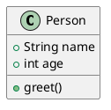

# Notes on UML

## Types of UML Diagrams

Unified Modeling Language (UML) provides several types of diagrams, broadly categorized as:

- **Structural Diagrams**
    - Class Diagram
    - Object Diagram
    - Component Diagram
    - Deployment Diagram
    - Package Diagram
    - Composite Structure Diagram

- **Behavioral Diagrams**
    - Use Case Diagram
    - Sequence Diagram
    - Activity Diagram
    - State Machine Diagram
    - Communication Diagram
    - Interaction Overview Diagram
    - Timing Diagram

## PlantUML (PUML)

PlantUML is an open-source tool that allows users to create UML diagrams from plain text descriptions. It supports various UML diagram types and is widely used for documentation and design.

**Example (Class Diagram in PlantUML):**

## UML Process

1. **Requirement Analysis:** Gather and analyze system requirements.
2. **Identify Actors and Use Cases:** Define system actors and their interactions.
3. **Model Structure:** Create class and object diagrams to represent system structure.
4. **Model Behavior:** Use sequence, activity, and state diagrams to model system behavior.
5. **Refinement:** Iterate and refine diagrams as the design evolves.
6. **Documentation:** Use UML diagrams to document the system for stakeholders and developers.

